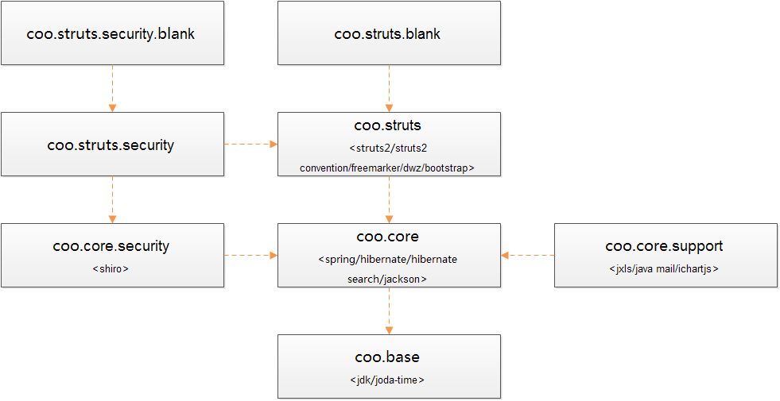

#项目简介
**把复杂的事情变简单，把繁琐的事情变简洁。**

coo是一个 Java Web Application 开发框架，用于支撑快速开发。它基于市面流行的开源框架进行封装整合，屏蔽这些开源框架本身的复杂性。以降低开发人员的学习成本并提升开发效率和质量。

coo全部利用开源框架本身的接口和特性进行封装和扩展，对于开源框架本身没有任何侵入性的修改。所有开源框架本身具备的功能和特性依然可以毫无阻碍的继续使用。

从分层的角度来看coo整合的主要的开源框架包括：
* 数据层：[hibernate][]/[hibernate search][]
* 业务层：[spring][]/[shiro][]
* 表现层：[spring mvc][]/[freemarker][]
* UI层：[dwz][]/[bootstrap][]

coo支持模块化开发，通过简单的配置即可实现对模块的插拔和升级（非热部署），这给产品的模块化定制及分发后聚拢升级带来极大的便利。

#框架构成

coo由以下子模块项目组成：
* [coo.base](coo.base): 基础模块。基础工具类、异常定义、常量定义、基础模型等。
* [coo.core](coo.core): 核心模块。整合封装[hibernate][]/[hibernate search][]/[spring][]的核心模块。
* [coo.core.support](coo.core.support)：支撑模块。邮件、报表等通用支撑功能模块，整合封装[ichartjs][]/[jxls][]。
* [coo.core.security](coo.core.security): 安全模块。整合[shiro][]作为权限控制模块。
* [coo.mvc](coo.mvc)：整合封装[spring mvc][]/[freemarker][]/[dwz][]/[bootstrap][]作为表现层基础模块。
* [coo.mvc.security](coo.mvc.security)：基于[spring mvc][]的权限控制模块。
* [coo.mvc.blank](coo.mvc.blank)：不带权限控制的脚手架项目。
* [coo.mvc.security.blank](coo.mvc.security.blank)：带有权限控制的脚手架项目。
* [coo.mvc.boot](coo.mvc.boot)：基于模块化开发的带有权限控制的脚手架项目。
* [coo.db](coo.db)：数据库设计。

#依赖关系

#快速开始
* [不带权限控制的脚手架](coo.struts.blank)
* [带有权限控制的脚手架](coo.struts.security.blank)
* [基于模块化开发的带有权限控制的脚手架](coo.mvc.boot)
	
[hibernate]: http://hibernate.org/
[hibernate search]: http://hibernate.org/search/
[spring]: http://projects.spring.io/spring-framework/
[shiro]: http://shiro.apache.org/
[spring mvc]: http://projects.spring.io/spring-framework/
[freemarker]: http://freemarker.org/
[dwz]: http://j-ui.com/
[bootstrap]: http://getbootstrap.com/
[ichartjs]: http://www.ichartjs.com/
[jxls]: http://jxls.sourceforge.net/