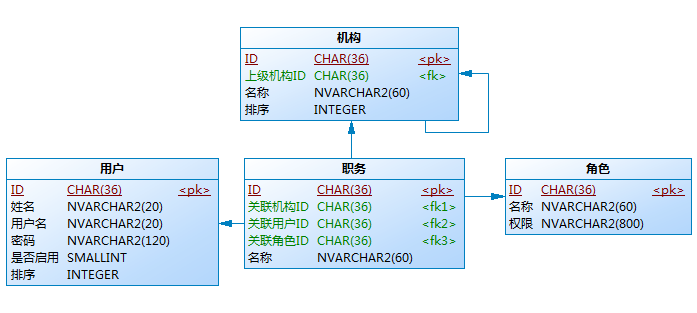

#安全模块
安全模块整合shiro来实现权限管理，采用基于角色访问控制的权限体系，但有一些自己的特点。

1. 这个权限体系最初来源于政府项目需求，权限体系中包含有机构、用户、角色三个实体，但三个实体之间并没有直接的关联关系，而是引入了一个“职务”实体来为三个实体之间建立连接关系，这主要是为了解决跨部门任职问题。
2. 权限没有细分到资源和操作级别，因为绝大部分情况下不需要这么细的权限粒度，降低权限体系复杂度。
3. 权限采用“位编码”`01010101...01100011`表示，对应权限位为0表示无权限，为1表示有权限。
4. 权限体系中的实体是跟随系统需求变化的，所以只定义了最简属性的泛型权限实体和基础安全服务接口。

最终整个权限体系主体之间的关联关系和基本属性被简化成下图所示：

##权限配置和权限位编码
权限通过permissions.xml文件进行配置：

	<?xml version="1.0" encoding="UTF-8"?>
	<permissions>
		<!-- 内置权限组，不允许修改 -->
		<permission-group name="管理员权限">
			<permission id="1" name="机构用户管理" code="ADMIN" depends="" />
		</permission-group>
		<!-- 示例模块 -->
		<permission-group name="部门管理">
			<permission id="11" name="部门管理" code="COMPANY_MANAGE" depends="" />
			<permission id="12" name="职员管理" code="EMPLOYEE_MANAGE" depends="" />
		</permission-group>
	</permissions>
	
其中`permission-group`元素将权限分组，`permission`元素定义权限。`id`表示权限在位编码中占据的位置，
`code`作为编码时引用的权限代码，`depends`表示依赖其它的权限（暂未实现）。

权限位编码默认采用300个字符的`01010101...01100011`字符串表示，可以根据系统需求调整，
但调整为更大前应慎重考虑角色设计的合理性和最终授权界面的可用性。

##资源实体
业务系统中很多业务实体都需要记录4个相同的属性：创建人、创建时间、最后修改人、最后修改时间，
这里称之为“资源实体”。在存储这些资源实体时，每次都要重复的设置这些相同的属性是一件很繁琐的事情。

安全模块中定义了资源实体的抽象基类(ResourceEntity)，并通过自定义Annotation(@AutoFillResourceEntity)
和Spring AOP实现了资源实体存储时自动填充。

##日志组件
业务系统对于日志记录的需求通常分为普通日志和高级日志：
* 普通日志只需要记录：什么人什么时间做了什么事情。
* 高级日志还需要记录：创建/修改/删除了什么信息，修改前的信息是什么，修改后的信息是什么。

安全模块通过日志切面组件和自定义注解@Log/@LogField/@LogBean实现了记录业务日志的功能，简化了开发人员对业务日志的处理。